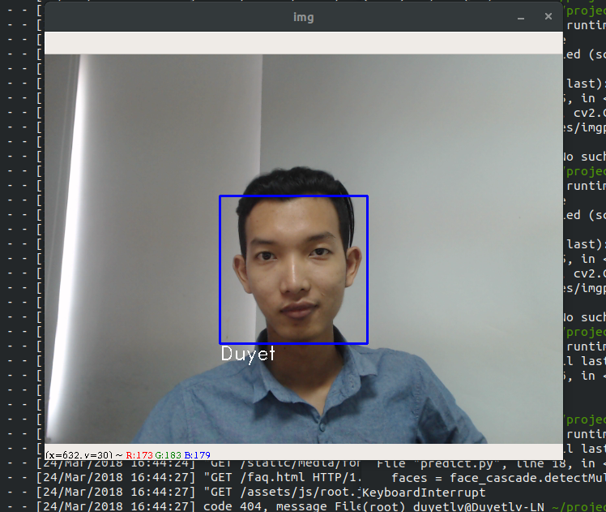

# PM Detector

You hate your PM right? How to detect him and trigger something? 

# Install 

Install python, opencv.

```
pip install -r requirements.txt
```

# Getting started

1. Get the training faces

```
python get_training_face.py

Enter user id: 1
```

It will capture **200** images for **label 1**.


2. Train the model:


```
python train_model.py
```

3. Predict 

```
python predict.py
```



------------
Open the `predict.py`, add some code to trigger something.	


